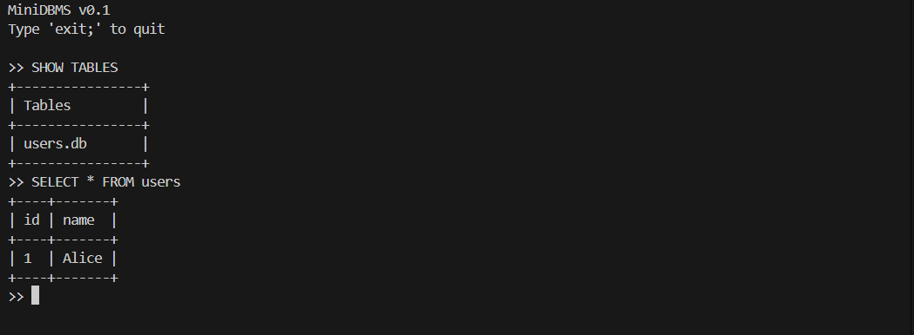

## Mini Data Base Management System (Under development)

### This is simple DBMS developed in C++

### Features

 <ul>
    <li>CREATE Table</li>
    <li>Update Record</li>
    <li>Show Tables</li>
    <li>Delete Record</li>
    <li>Select Record</li>
    <li>Drop Table</li>
</ul>

### Screenshots

